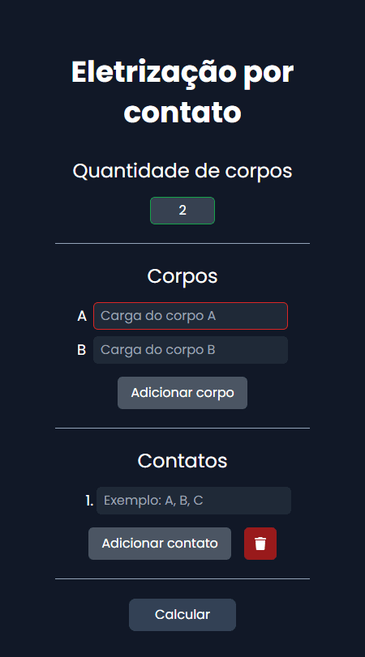

<h1 align="center">Eletrização por contato</h1>

### Descrição
Esse site calcula a eletrização por contato entre dois ou mais corpos. Nele, é possível definir quantos corpos participarão dos contatos, qual a energia inicial de cada um e a sequência dos contatos entre eles. O resultado final contém a carga resultante de cada contato, assim como a soma total das cargas.

### Capturas de tela

<picture>
  <source type="image/webp" srcset=".github/screenshot.webp">
  
</picture>

<picture>
  <source type="image/webp" srcset=".github/screenshot-1.webp">
  
</picture>

### Licença

[ISC](LICENSE.md) © 2024 Kayo Souza
